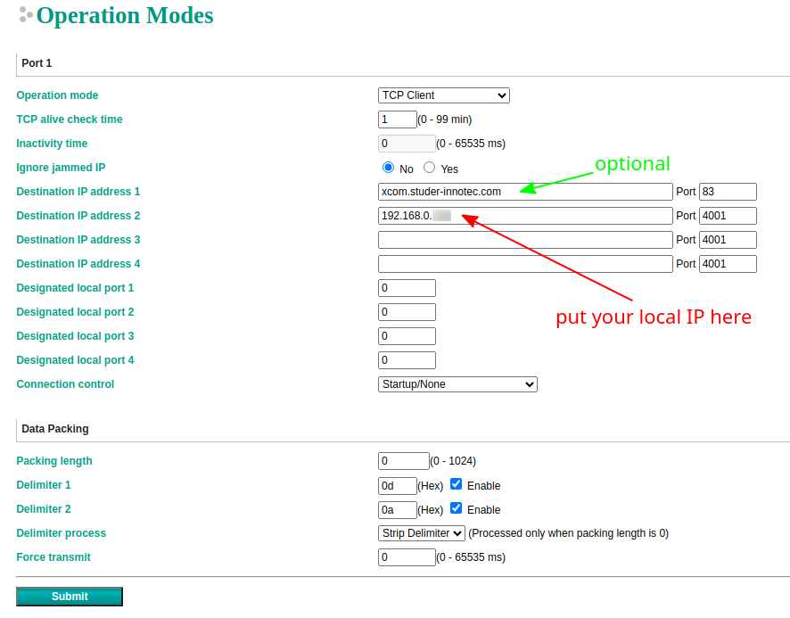
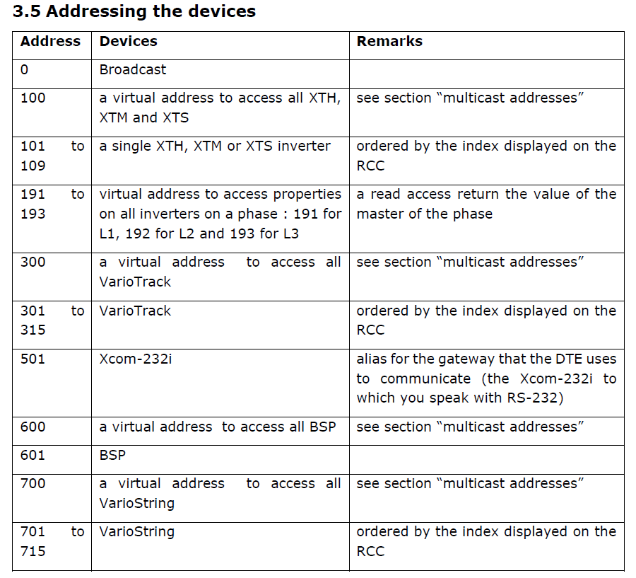

# xcom-protocol

Python library implementing Studer-Innotec Xcom protocol for Xcom-232i and Xcom-LAN (TCP/UDP).

NOTE: This lib is still WiP, so functionality is still limited, but feel free to create a [pull request](https://github.com/zocker-160/xcom-protocol/pulls) if you want to contribute ;)

DISCLAIMER: This library is NOT officially made by Studer-Innotec.

The complete official documentation is available on: \
[Studer-Innotec Download Center](https://www.studer-innotec.com/en/downloads/) *-> Software and Updates -> Communication protocol Xcom-232i*

## Getting Started

### Requirements
#### Hardware

- Xcom-232i or Xcom-LAN connected to your installation
- Xcom-232i connected to PC using USB to RS-232 adapter (1) or PC in same local network as Xcom-LAN device
- PC with at least USB2.0 or faster (works on Raspberry Pi 3/4 as well)

(1) I personally am successfully using an adapter with the PL2303 chipset like [this one](https://www.amazon.de/dp/B00QUZY4UG)

#### Software

- any Linux based OS (x86 / ARM)
- python3 >= 3.9
- python3-pip

### Installation

```bash
pip install xcom-proto
```
#### Important

- make sure you select the USB to RS-232 adapter as the `serialDevice`, usually on Linux it is `/dev/ttyUSB[0-9]`
- when using Xcom-LAN UDP make sure MOXA is set up properly and reachable via a static IP in the local network
- when using Xcom-LAN TCP make sure your device IP is static, reachable in the local network and specified in the MOXA

### MOXA Setup for Xcom-LAN TCP


- address to Studer Portal is optional and can be removed if you don't need their web interface
- `Data Packing` has to be set exactly as shown, you will get `AssertionError` otherwise

#### Important
If you want Studer Portal to still keep working, make sure you wait for at least 5 - 10 seconds to give it time to send data.

### Adressing Devices

Make sure you are setting the correct destination Address `dstAddr` otherwise read / write operations might not work.

By default `getValue` and `setValue` use the address `100`, which is a multicast address for all XTH, XTM and XTS devices, it does NOT include VarioTrack, VarioString or BSP.

Furthermore if you have more than one device of each type (VarioString, VarioTrack, XTS etc.) then using the multicast address is probably not desired either.

**NOTE:** for code examples see below

All used addresses of Studer devices can be found in the Studer documentation (page 8, section 3.5):


## Examples
### Reading values

```python
from xcom_proto import XcomP as param
from xcom_proto import XcomC
from xcom_proto import XcomRS232
from xcom_proto import XcomLANUDP

xcom = XcomRS232(serialDevice="/dev/ttyUSB0", baudrate=115200)
# OR (default ports are 4002 and 4001)
xcom = XcomLANUDP("192.168.178.110")
# OR overwriting ports
xcom = XcomLANUDP("192.168.178.110", dstPort=4002, srcPort=4001)

boostValue = xcom.getValue(param.SMART_BOOST_LIMIT)

pvmode = xcom.getValue(param.PV_OPERATION_MODE)
pvpower = xcom.getValue(param.PV_POWER) * 1000 # convert from kW to W
sunhours = xcom.getValue(param.PV_SUN_HOURS_CURR_DAY)
energyProd = xcom.getValue(param.PV_ENERGY_CURR_DAY)

soc = xcom.getValue(param.BATT_SOC)
battPhase = xcom.getValue(param.BATT_CYCLE_PHASE)
battCurr = xcom.getValue(param.BATT_CURRENT)
battVolt = xcom.getValue(param.BATT_VOLTAGE)

# please look into the official Studer parameter documentation to find out
# what type a parameter has
pvmode_manual = xcom.getValueByID(11016, XcomC.TYPE_SHORT_ENUM)

# using custom dstAddr (can also be used for getValueByID())
solarPowerVS1 = xcom.getValue(param.VS_PV_POWER, dstAddr=701)
solarPowerVS2 = xcom.getValue(param.VS_PV_POWER, dstAddr=702)

print(boostValue, pvmode, pvpower, sunhours, energyProd, soc, battPhase, battCurr, battVolt)
```

#### XcomLAN TCP

```python
from xcom_proto import XcomP as param
from xcom_proto import XcomC
from xcom_proto import XcomRS232
from xcom_proto import XcomLANTCP

with XcomLANTCP(port=4001) as xcom:
    boostValue = xcom.getValue(param.SMART_BOOST_LIMIT)
    # same as above
```

### Writing values

**IMPORTANT**:
`setValue()` and `setValueByID()` have an optional named parameter `propertyID` which you can pass either:

- `XcomC.QSP_UNSAVED_VALUE`: writes value into RAM only (default when not specified)
- `XcomC.QSP_VALUE`: writes value into flash memory; **you should write into flash only if you *really* need it, write cycles are limited!**

```python
from xcom_proto import XcomP as param
from xcom_proto import XcomC
from xcom_proto import XcomRS232
from xcom_proto import XcomLANUDP

xcom = XcomRS232(serialDevice="/dev/ttyUSB0", baudrate=115200)
# OR (default ports are 4002 and 4001)
xcom = XcomLANUDP("192.168.178.110")
# OR overwriting ports
xcom = XcomLANUDP("192.168.178.110", dstPort=4002, srcPort=4001)

xcom.setValue(param.SMART_BOOST_LIMIT, 100) # writes into RAM
xcom.setValue(param.FORCE_NEW_CYCLE, 1, propertyID=XcomC.QSP_VALUE) # writes into flash memory

# using custom dstAddr
xcom.setValue(param.BATTERY_CHARGE_CURR, 2, dstAddr=101) # writes into RAM
xcom.setValue(param.BATTERY_CHARGE_CURR, 2, dstAddr=101, propertyID=XcomC.QSP_VALUE) # writes into flash memory

# using custom value by ID
xcom.setValueByID(1107, XcomC.TYPE_FLOAT, 30) # writes into RAM
xcom.setValueByID(1107, XcomC.TYPE_FLOAT, 30, propertyID=XcomC.QSP_VALUE) # writes into flash memory

# using custom value by ID and dstAddr
xcom.setValueByID(1107, XcomC.TYPE_FLOAT, 30, dstAddr=101) # writes into RAM
xcom.setValueByID(1107, XcomC.TYPE_FLOAT, 30, dstAddr=101, propertyID=XcomC.QSP_VALUE) # writes into flash memory
```

#### XcomLAN TCP

```python
from xcom_proto import XcomP as param
from xcom_proto import XcomC
from xcom_proto import XcomRS232
from xcom_proto import XcomLANTCP

with XcomLANTCP(port=4001) as xcom:
    xcom.setValue(param.SMART_BOOST_LIMIT, 100) # writes into RAM
    xcom.setValue(param.FORCE_NEW_CYCLE, 1, propertyID=XcomC.QSP_VALUE) # writes into flash memory
    # same as above
```

## Troubleshooting
### Writing value returns `Permission Denied` error

Usually this is caused by using the default multicast address to write values that are not part of the default address range. See [above](#adressing-devices) for more information.

### `AssertionError` (invalid header / frame)

Usually this is caused by a wrong MOXA setup when using UDP / TCP, make sure `Data Packing` is set correctly in the MOXA. See [above](#moxa-setup-for-xcom-lan-tcp) for more information.

When using Xcom-232i then checksum errors and AssertionErrors can be caused by a bad RS232 connection or a wrong BAUD rate setting.
